# Insignia Event Management System

Welcome to the Insignia 24 Event Management System! This project is designed to streamline and manage the various activities and events for the college fest, Insignia, conducted by Shri Dharmasthala College of Engineering and Technology, Dharwad.
**The system was executed flawlessly during Insignia 2024 without any errors.**

## Table of Contents

- [Introduction](#introduction)
- [Technologies Used](#technologies-used)
- [Features](#features)
- [Modules](#modules)
  - [Admin Module](#admin-module)
  - [Event Coordinator Module](#event-coordinator-module)
  - [Desk Manager Module](#desk-manager-module)
  - [Monitor Module](#monitor-module)
- [Contact](#contact)

## Introduction

Event Management System is a web-based application developed to manage the planning, organization, and execution of events for the college fest, Insignia, conducted by Shri Dharmasthala College of Engineering and Technology, Dharwad. This system aims to streamline event registration, payment management, and overall event coordination, eliminating the need for Google Forms. 

## Technologies Used

- **Frontend:**   
- **Framework:** 
- **Backend:**  
- **Email Service:** 

## Features

✨ **Dashboard:** Get a comprehensive overview of total participants, paid participants, accommodation details, event counts, and financial statistics.
  
👥 **User Management:** Easily create and manage users with different roles such as Admin, Event Coordinator, Desk Manager, and Monitor.
  
📅 **Event Management:** Seamlessly add and manage event information, including images and basic details.
  
📝 **Participant Management:** View and export participant details in various formats for easy tracking and record-keeping.
  
🔍 **Custom Filtering:** Filter participants based on events and payment status to quickly access the required information.
  
📧 **Email Notifications:** Automatically send confirmation emails to participants after registration.
  
💳 **Payment Management & Bill Generation:** Efficiently add, view, and manage payment details, and generate bills with ease.
  
📂 **Data Export:** Export participant and event data into PDF and Excel formats for convenient record-keeping.
  
🔐 **Secure Authentication:** Ensure data security with robust authentication mechanisms for all users.
  
📱 **Responsive Design:** Access the system on-the-go with a responsive, mobile-friendly interface.
  
🔧 **Separate Panels:** Different logins and panels for Event Coordinators to manage their specific tasks efficiently.

## Modules

### Admin Module

The Admin Module provides comprehensive control and oversight over the entire event management system. Key features include:

- **Dashboard:** Displays total participants, paid participants, accommodation details, total events, and financial details including amounts collected from various events (technical, cultural, centralized) and total collected via cash and online payments.
  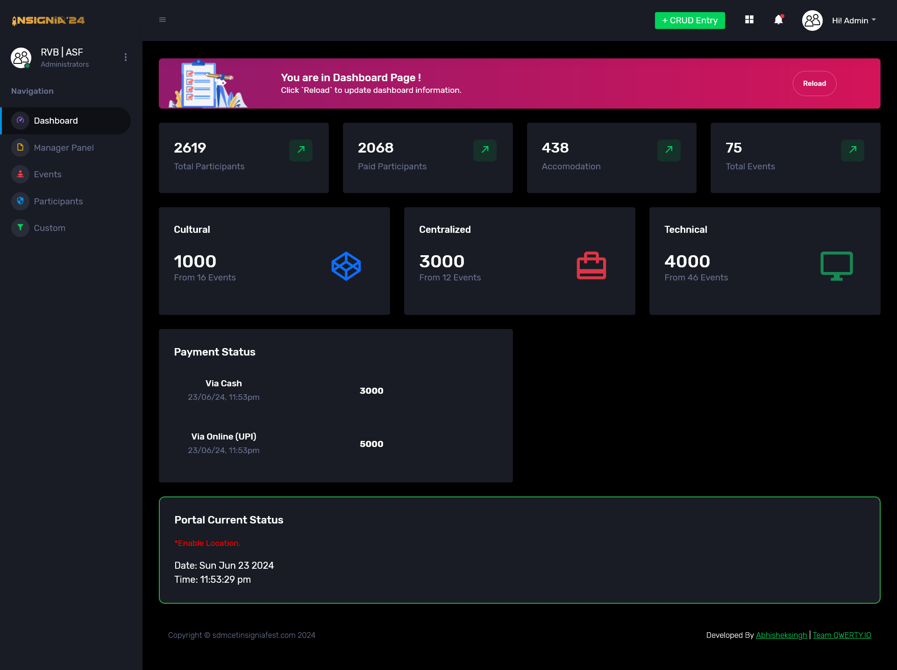

- **Manager Panel:** Allows the creation of users for different roles such as admin, coordinator, and desk manager.
  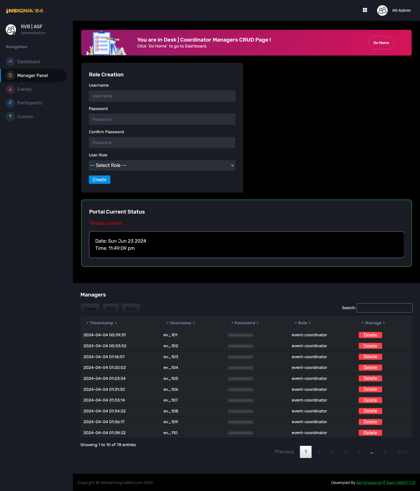

- **Events:** Add event information along with images and basic details.
  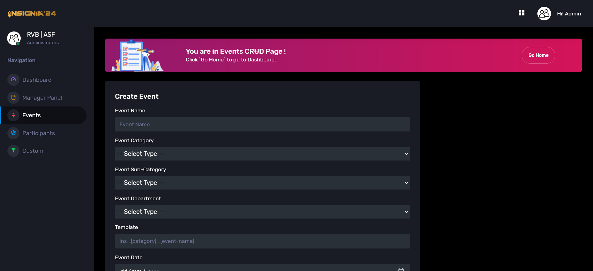
  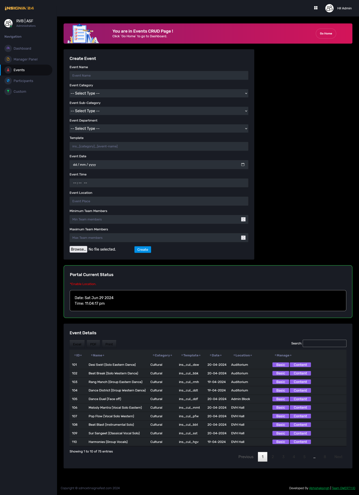
  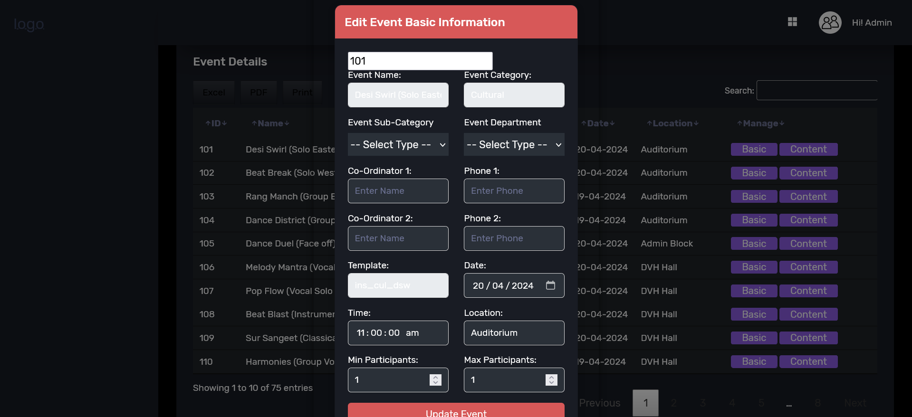

- **Participants:** View participant details and export them in Excel or PDF format.
  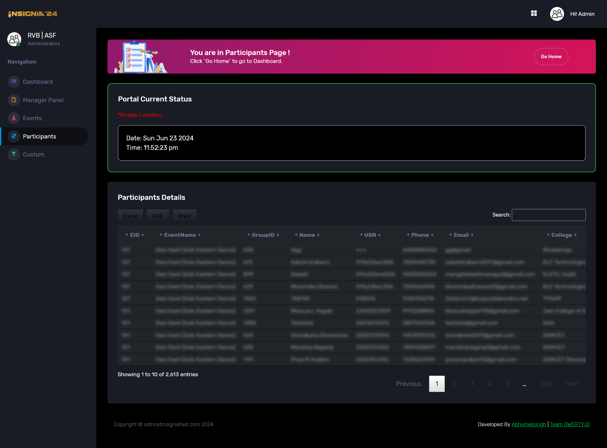

- **Custom Filters:** Filter participants based on events and payment status (paid and unpaid).
  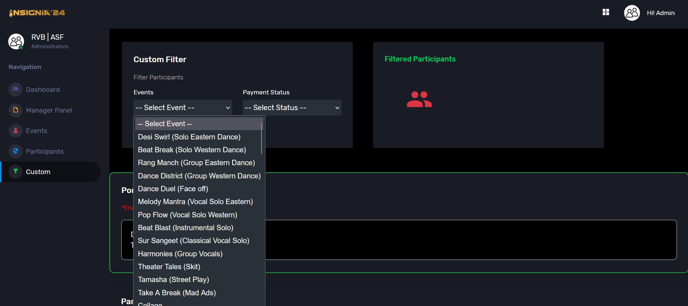

### Event Coordinator Module

The Event Coordinator Module is designed for coordinators to manage participants and event details efficiently. Key features include:

- **Dashboard:** Overview of total participants, paid participants, total groups, and paid groups.
  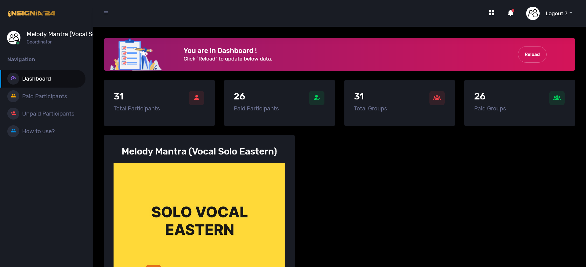
  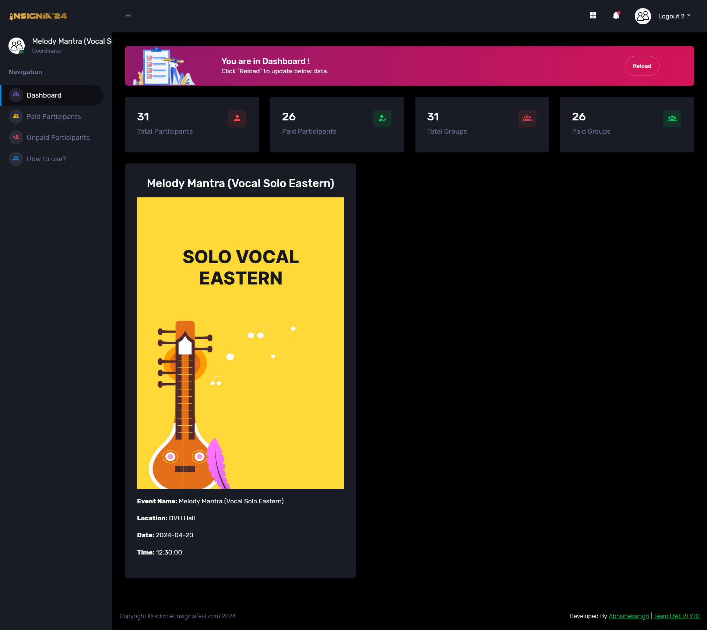

- **Paid Participants:** View and export details of paid participants in various formats.
  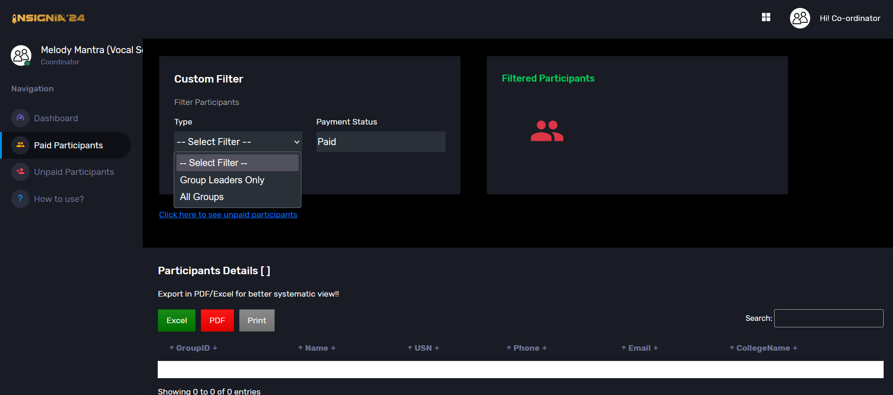

- **Unpaid Participants:** View details of unpaid participants.
  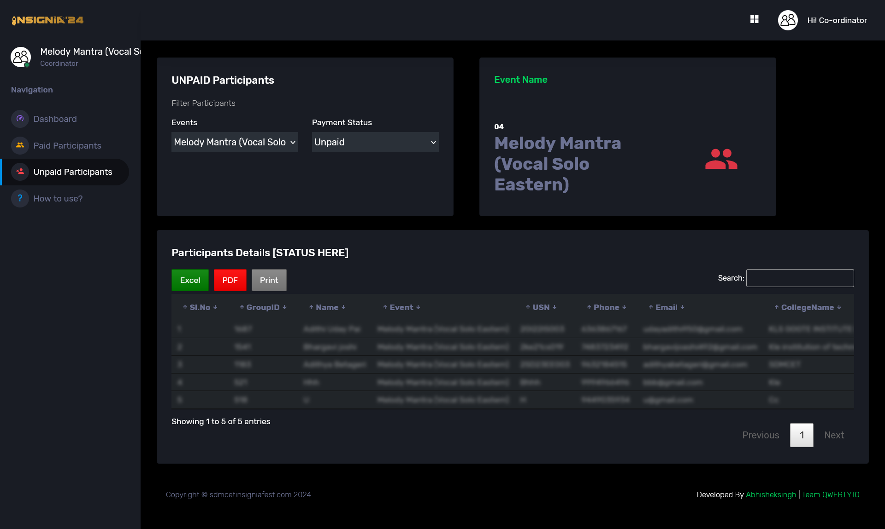

- **How to Use:** Guidelines and instructions for using the system.
  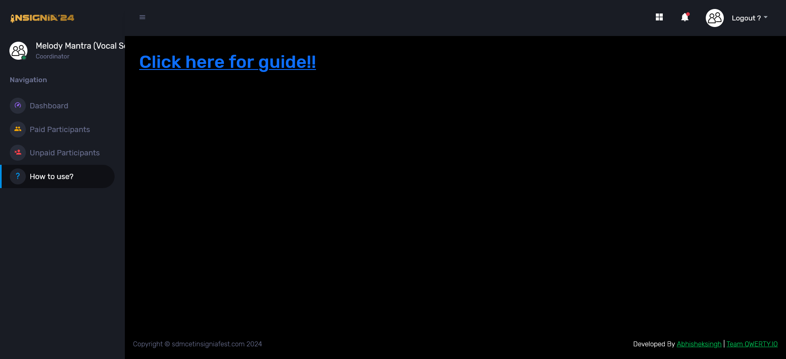

### Desk Manager Module

The Desk Manager Module focuses on managing on-site participant payments and registration. Key features include:

- **Desk Main Panel:** Add payment details with search functionality and a simple UI that includes bill number, amount, payment mode, and confirmation button.
  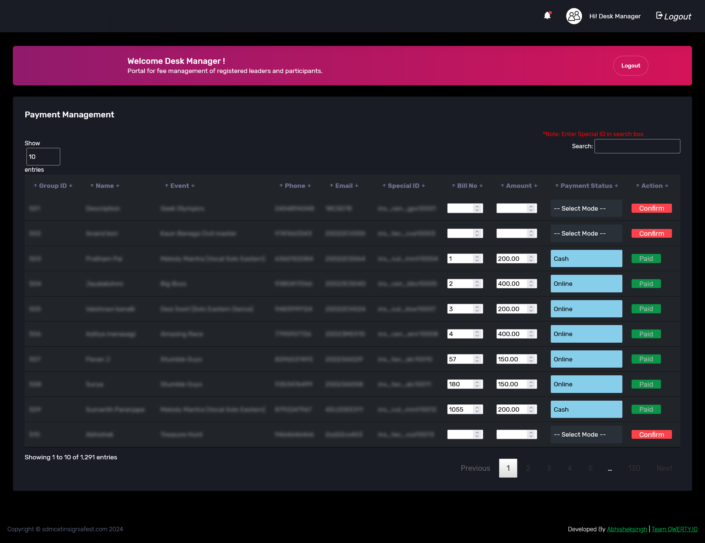

- **Payment Details:** View payment details with payment IDs and export them.
  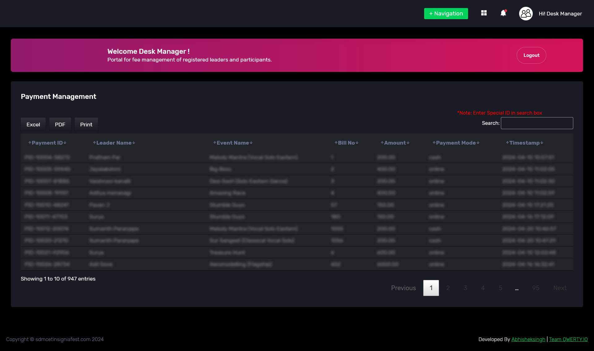

- **Bill Generator:** Generate bills by entering a special ID.
  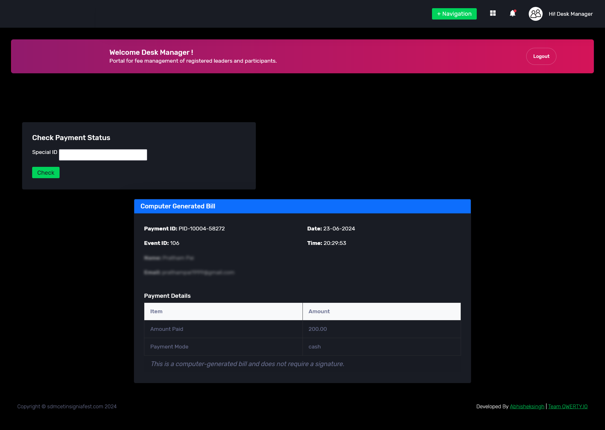

### Monitor Module

The Monitor Module is designed to provide an overview and detailed filtering of event participants. Key features include:

- **Participant Filtering:** Filter event participant details based on events and payment details.
  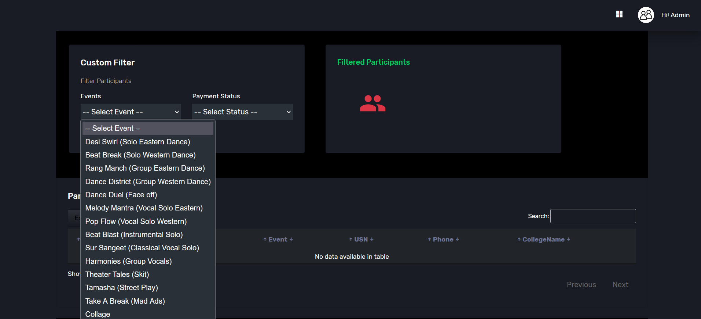

